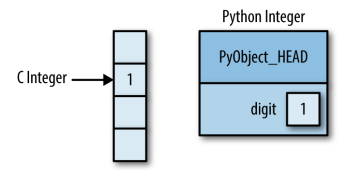

# Numpy

Python是一种弱类型的语言，在初始化变量时无需进行类型声明，这在带来写代码的方便时也为代码运行带来了负担。为了更好地进行数学计算，Numpy应运而生。它对类型的实现更接近C语言，从而大大减少了开销，并且提供了一系列高级操作来方便数学计算，从而成为了数据处理中不可或缺的一环。



## 创建array

```python
# 普通方式
a = np.array([1,2,3]) #一维
b = np.array([[1,2,3],[4,5,6]]) #多维
c = np.arange(1,10,2) #arange
d = np.linspace(0,1,5) #start, end, num-points

# 特殊array
a = np.zeros((4,))
b = np.ones((4,))
c = np.eye(4)
d = np.diag([1,2,3,4])

# random
a = np.random.rand(4) # uniform in [0, 1]
b = np.random.randn(4) # Gaussian
c = np.random.randint(1,4,(3,4)) # Return random integers from `low` (inclusive) to `high` (exclusive).
```

## 查看array属性

```python
a.ndim #查看array的维度
a.ntype #查看元素类型
a.shape #查看array形状
```

## 可处理类型

- float64
- int64
- int32
- uint32
- uint64
- Complex 如：a = np.array([1+2j,2+1j])
- Bool 如：a = np.array([True,False])
- String 如： a = np.array(['hello','hi'])

## 简单可视化

### 一维
```python
x = np.linspace(0,3,20)
y = np.linspace(0,6,20)
plt.plot(x,y,'o')
```


### 二维
```python
img = np.random.rand(30,30)
plt.imshow(img,cmap=plt.cm.BrBG_r)
plt.colorbar()
```


## 索引和切片

这部分和Python基本一致。

## Fancy indexing

```
mask = (a%4==0)
b = a[mask]

ind=[2,0,1]
a[ind]
```

## 数学操作

```python
# Elementwise operations
a+1
2**a

# matrix multiplication
a.dot(b)

# Comparisons
a == b

# Array-wise comparisons
np.array_equal(a,b)

# Logical operations
np.logical_and(a,b)

# Transcendental functions
np.sin(a)
np.log(a)
np.exp(a)

# 转置
a.T

# 统计
np.sum(x)
x.sum(axis=0) # columns (first dimension)
x.sum(axis=1) # rows (second dimension)

```

## Broadcasting

当出现形状不匹配时，广播规则如下：


## Array shape manipulation

### Flattening

```python
a.ravel()
a.flatten()
```

### Reshaping

```python
b.reshape((2, 3))
```

### Adding a dimension

```python
a[:, np.newaxis]
```

### Dimension shufing

```python
a.transpose(1, 2, 0)
```

### Resizing

```python
a.resize((4,3,4))
np.resize(a,(5,4,3))
```

### Sorting

```python
np.sort(a, axis=1)
a.sort(axis=1)
np.argsort(a)
```

## Loading data fles

```python
data = np.loadtxt('data/populations.txt')
np.savetxt('pop2.txt', data)
np.save('pop.npy', data)
np.load('pop.npy')
```


